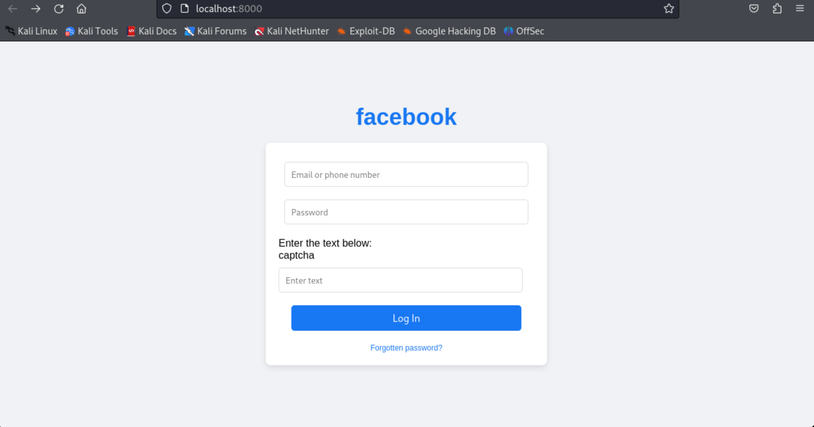
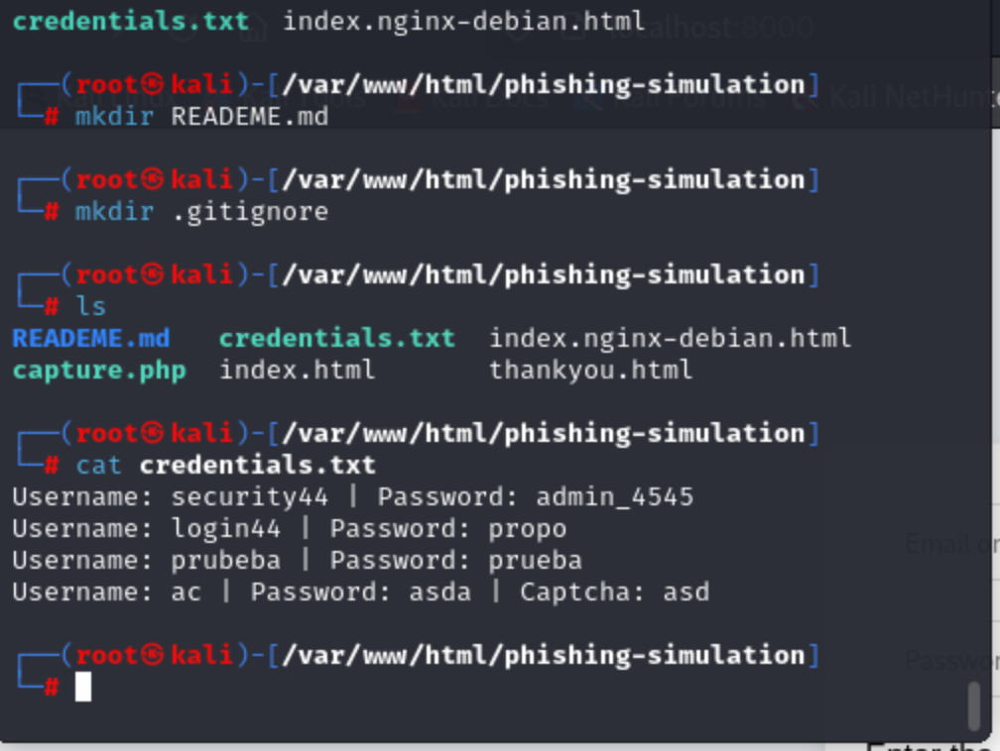

# Simulación de Phishing 🚨

Este proyecto demuestra cómo funciona una simulación educativa de un ataque de phishing mediante la creación de una página falsa que replica el inicio de sesión de una red social popular. Fue realizado como parte de mi portafolio para especializarme en **Análista de Ciberseguridad** dentro del campo de la ciberseguridad.

---

## Objetivos del Proyecto 🛠️

1. Configurar un entorno seguro para simular un ataque de phishing.
2. Diseñar una página de inicio de sesión falsa que imite la interfaz de Facebook.
3. Capturar credenciales ingresadas por usuarios de prueba y almacenarlas de manera controlada.
4. Documentar el proceso y analizar los riesgos asociados a este tipo de ataques.

---

## Herramientas Utilizadas 🔧

- **HTML/CSS**: Para diseñar la interfaz de usuario de la página de phishing.  
- **PHP**: Para capturar y almacenar credenciales.  
- **Kali Linux**: Entorno de pruebas en una máquina virtual con VMware.  
- **GitHub**: Para documentar y compartir el proyecto.

---

## Pasos Realizados 📝

1. **Configuración del Entorno**  
   - Configuré una máquina virtual con **Kali Linux** usando **VMware** en macOS.  
   - Instalé un servidor local para ejecutar el proyecto utilizando PHP.  

2. **Diseño del Formulario de Login Falso**  
   - Creé una página **index.html** que replica el diseño del inicio de sesión de Facebook.  
   - Personalicé la página con estilos en **style.css** para hacerlo visualmente idéntico.

3. **Captura de Credenciales**  
   - Implementé un script en **PHP (capture.php)** que captura los datos ingresados (correo y contraseña).  
   - Los datos capturados se almacenaron localmente en un archivo `credentials.txt`.

4. **Pruebas del Flujo**  
   - Inicié un servidor local con `php -S localhost:8000` y probé la funcionalidad.  
   - Verifiqué que las credenciales de prueba se almacenan correctamente en el archivo.

---

## Resultados Principales 📊

| Elemento       |                         Resultado                            |
|----------------|--------------------------------------------------------------|
| **Interfaz**   | Réplica convincente del login de Facebook.                   |
| **Captura**    | Credenciales almacenadas correctamente en `credentials.txt`. |
| **Servidor**   | Proyecto funcional en servidor local con PHP.                |

- **Hallazgo Destacado**:  
  - Flujo completo de simulación de phishing configurado con éxito.  
  - El proyecto permite estudiar las vulnerabilidades asociadas a interfaces falsas.  
  - **Advertencia:** Este proyecto es educativo y no debe ser usado con fines malintencionados.

---

## Capturas de Pantalla 📷

| Página Principal         | Credenciales Capturadas  |
|--------------------------|--------------------------|
|  |  |

---

## Próximos Pasos 🚀

1. Añadir funcionalidades avanzadas como captchas falsos y mensajes de error personalizados.  
2. Implementar medidas para dificultar la detección de la página falsa mediante inspección visual.  
3. Ampliar el proyecto simulando escenarios más complejos, como ataques de redireccionamiento.

---

## Autor 👨‍💻

**[Jorge Balarezo Cardenas]**  
- LinkedIn: [Enlace a tu perfil](https://www.linkedin.com/in/jorge-balarezo-cardenas/) 
- Email: [jbalarezocarden@gmail.com]

---

## Licencia 📜

Este proyecto está bajo la Licencia MIT. Para más detalles, revisa el archivo [LICENSE](LICENSE).
